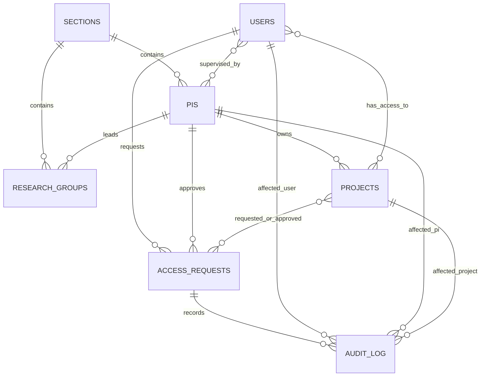
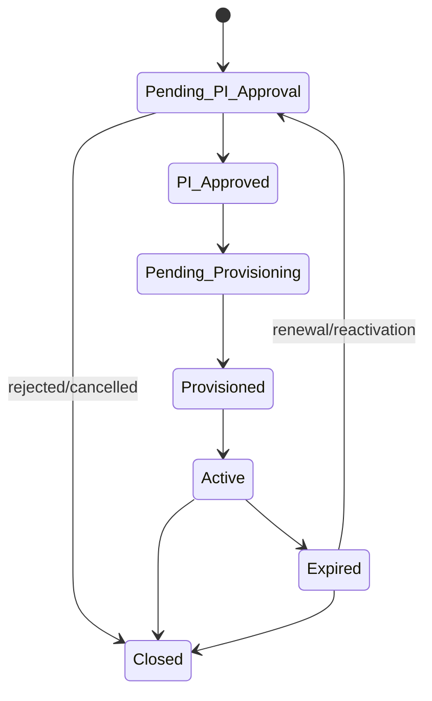
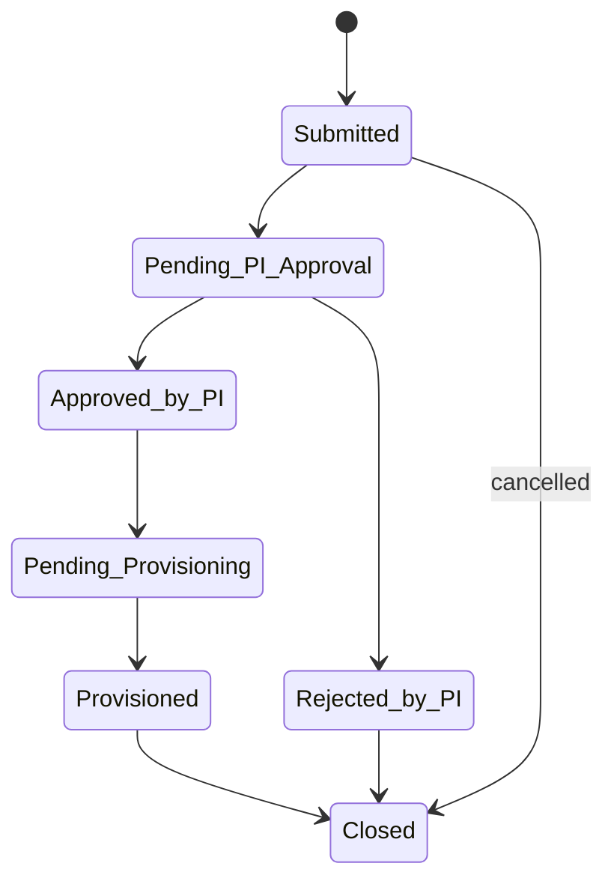
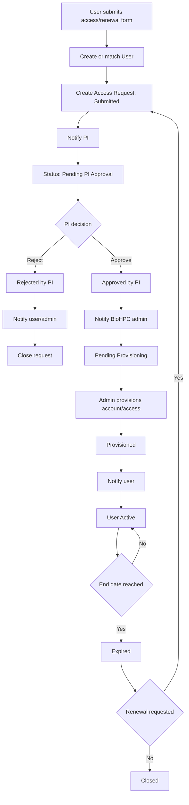

# BioHPC Onboarding and Access Management Design

Status: design proposal only  
Source: `BioHPC_Airtable_Audit.md`  
Implementation: not approved, no Airtable changes made

## Design Principles

- Keep `PIs`, `Users`, `Projects`, `Sections`, and `Research Groups` as master data tables.
- Add one central workflow table: `Access Requests`.
- Add one permanent trace table: `Audit Log`.
- Store workflow state on requests, not as copied free text across master tables.
- Prefer linked records over copied names, emails, and IDs.
- Treat `Users` as the account state table and `Access Requests` as the lifecycle/event table.
- Use forms to create/update requests, and automations to move requests through states.
- Do not rely on hard-coded Airtable page IDs in formulas.

## ER Diagram

## Part 1: New Tables

### Access Requests

Purpose: central workflow engine for all account/access lifecycle events. Each record represents one request: new user access, additional project access, end-date extension, reactivation, or project creation request.

Primary field: `Request ID`, preferably formula based on autonumber, e.g. `REQ-0001`.

| Field | Type | Required | Description |
|---|---|---:|---|
| Request ID | Formula | Yes | Human-readable stable request identifier. |
| Request Number | Autonumber | Yes | Sequential number used by Request ID. |
| Request Type | Single select | Yes | New user access, Additional project access, Extend end date, Reactivate expired account, Project creation. |
| Status | Single select | Yes | Submitted, Pending PI Approval, Approved by PI, Rejected by PI, Pending Provisioning, Provisioned, Active, Expired, Closed. |
| User | Link to `Users` | Yes | User/account affected by the request. For new users, create or match a User record first. |
| PI | Link to `PIs` | Yes | PI responsible for approval. |
| Requested Projects | Link to `Projects` | Conditional | Projects requested by user. Required for new access/additional project access. |
| Approved Projects | Link to `Projects` | Conditional | PI-approved subset of requested projects. |
| Requested Queue | Multiple select | Conditional | Requested queue(s): `BioHPC_Normal`, `BioHPC_Long`. |
| Approved Queue | Multiple select | Conditional | PI/admin-approved queue(s). |
| Requested End Date | Date | Conditional | Requested expiration/end date. Required for new access, renewal, and reactivation. |
| Approved End Date | Date | Conditional | End date approved by PI/admin. |
| Project Creation Details | Long text | Optional | For project creation requests before a real Project exists. |
| Requested Project Name | Single line text | Conditional | Project name for project creation requests. |
| Requested Capacity | Single select | Optional | Mirrors project capacity categories. |
| Requested Backup - Apps | Single select | Optional | Backup choice for project creation. |
| Requested Backup - Data | Single select | Optional | Backup choice for project creation. |
| Requested Backup - People | Single select | Optional | Backup choice for project creation. |
| Requested Audit Requirement | Single select | Optional | Whether project data should be audited. |
| Agreement to BioHPC Policies | Checkbox | Yes | Captures user policy acceptance at request time. |
| User Submitted Email | Email | Yes | Snapshot of requester email for notifications. |
| Communication Email | Email or formula | Yes | Email to use for user notifications. |
| PI Decision | Single select | Conditional | Pending, Approve, Reject. |
| PI Decision Date | Date/time | Conditional | Timestamp when PI submitted decision. |
| PI Comments | Long text | Optional | PI notes/reason. |
| Rejection Reason | Long text | Conditional | Required when rejected. |
| Provisioning Date | Date/time | Conditional | When admin completed provisioning. |
| Provisioned By | Collaborator or single line text | Conditional | Admin who provisioned account/access. |
| Admin Notes | Long text | Optional | Internal operational notes. |
| Source Form | Single select | Optional | User Access Request, PI Approval, Renewal Request, Admin Manual. |
| External Ticket ID | Single line text | Optional | Link to external ticketing/helpdesk if used. |
| Approval Token | Single line text | Recommended | Random request-specific token used in approval links. |
| Approval Link | Formula or button | Recommended | Generated link to PI approval form/interface using request ID/token. |
| Last Status Change | Last modified time | Recommended | Tracks status changes. |
| Created Time | Created time | Yes | Airtable creation timestamp. |
| Last Modified | Last modified time | Yes | Last edit timestamp. |
| Processed | Checkbox | Optional | Only if needed for automation guard; status should remain primary. |

### Audit Log

Purpose: permanent administrative audit trail. The table should be append-only in practice. Automations and admins create audit rows for meaningful workflow events.

Primary field: `Audit ID`, preferably formula based on autonumber, e.g. `AUD-0001`.

| Field | Type | Required | Description |
|---|---|---:|---|
| Audit ID | Formula | Yes | Human-readable audit identifier. |
| Audit Number | Autonumber | Yes | Sequential audit row number. |
| Timestamp | Created time | Yes | When the audit row was created. |
| Action Type | Single select | Yes | PI Approved Request, PI Rejected Request, Project Assigned, Queue Changed, Account Created, Account Activated, Account Expired, End Date Extended, Project Added, Project Removed, Request Submitted, Request Closed, Manual Admin Change. |
| Access Request | Link to `Access Requests` | Recommended | Request that caused the action. |
| User | Link to `Users` | Optional | Affected user. |
| PI | Link to `PIs` | Optional | Affected or approving PI. |
| Project | Link to `Projects` | Optional | Affected project. |
| Performed By | Collaborator or single line text | Recommended | Person or automation responsible. |
| Actor Type | Single select | Recommended | User, PI, Admin, Automation, System. |
| Old Value | Long text | Optional | Previous value or JSON snapshot. |
| New Value | Long text | Optional | New value or JSON snapshot. |
| Notes | Long text | Optional | Human-readable explanation. |
| Source | Single select | Optional | Form, Automation, Manual, Import, API. |
| Correlation ID | Single line text | Optional | Shared ID for multi-step automation runs. |
| Automation Name | Single line text | Optional | Name of automation that created the log entry. |
| Severity | Single select | Optional | Info, Warning, Error. |

## Part 2: Access Requests as Workflow Engine

`Access Requests` owns request state. `Users` owns account state. `Projects`, `PIs`, `Sections`, and `Research Groups` remain master data.

Recommended request types:

- `New user access`
- `Additional project access`
- `Extend end date`
- `Reactivate expired account`
- `Project creation`
- `Admin adjustment`

Recommended request status values:

- `Submitted`
- `Pending PI Approval`
- `Approved by PI`
- `Rejected by PI`
- `Pending Provisioning`
- `Provisioned`
- `Active`
- `Expired`
- `Closed`

Recommended field groups:

- Identity: `Request ID`, `Request Type`, `Status`, `User`, `PI`.
- Requested access: `Requested Projects`, `Requested Queue`, `Requested End Date`.
- Approved access: `Approved Projects`, `Approved Queue`, `Approved End Date`.
- PI decision: `PI Decision`, `PI Decision Date`, `PI Comments`, `Rejection Reason`.
- Provisioning: `Provisioning Date`, `Provisioned By`, `Admin Notes`, `External Ticket ID`.
- Audit/control: `Created Time`, `Last Modified`, `Last Status Change`, `Source Form`, `Approval Token`, `Processed`.

## Part 3: Audit Log Design

Every significant transition should create an `Audit Log` row. Do not use audit fields as workflow state; they are evidence.

Recommended action types:

- `Request Submitted`
- `PI Approval Requested`
- `PI Approved Request`
- `PI Rejected Request`
- `Project Assigned`
- `Queue Changed`
- `Account Created`
- `Account Activated`
- `Account Expired`
- `End Date Extended`
- `Project Added`
- `Project Removed`
- `User Reactivated`
- `Request Closed`
- `Manual Admin Change`
- `Automation Error`

Compliance recommendations:

- Store old/new values for status, projects, queue, and end date.
- Store `Performed By` for all manual admin actions.
- Store `Actor Type = Automation` and `Automation Name` for automation-generated rows.
- Never edit audit rows except for administrative correction with a second audit row explaining the correction.

## Part 4: Complete Lifecycle

### A. User Access Request

Trigger: user submits User Access Request Form.

Actions:

- Create or match a `Users` record using KU-ID or KU email.
- Create `Access Requests` record.
- Set `Request Type = New user access`.
- Set `Status = Submitted`.
- Link selected PI and requested projects.
- Store requested queue and end date.
- Confirm BioHPC policy agreement.
- Create `Audit Log` row: `Request Submitted`.

Tables affected: `Users`, `Access Requests`, `Audit Log`.

Status transitions:

- Access Request: none -> `Submitted` -> `Pending PI Approval`.
- User Account Status: none/new -> `Pending PI Approval`.

### B. PI Approval

Trigger: Access Request enters `Pending PI Approval`.

Actions:

- Send PI an approval email with request summary and approval form link.
- PI approves/rejects using PI Approval Form.
- On approval, write approved projects, queue, end date, comments, and decision date.
- On rejection, write rejection reason/comments.
- Create corresponding `Audit Log` row.

Tables affected: `Access Requests`, `Users`, `Audit Log`.

Status transitions:

- Access Request: `Pending PI Approval` -> `Approved by PI` or `Rejected by PI`.
- User Account Status: `Pending PI Approval` -> `PI Approved` or remains pending until final rejection handling.

### C. Provisioning

Trigger: Access Request becomes `Approved by PI`.

Actions:

- Set Access Request to `Pending Provisioning`.
- Notify BioHPC admins.
- Admin creates Unix/HPC account or adds requested access.
- Admin links approved projects to User.
- Admin sets approved queue and end date on User if those remain account-level fields.
- Admin records `Provisioning Date` and `Provisioned By`.
- Create audit rows for account creation, project assignment, queue change, and end date.

Tables affected: `Access Requests`, `Users`, `Projects`, `Audit Log`.

Status transitions:

- Access Request: `Approved by PI` -> `Pending Provisioning` -> `Provisioned`.
- User Account Status: `PI Approved` -> `Pending Provisioning` -> `Provisioned`.

### D. Activation

Trigger: provisioning is complete and user has been notified.

Actions:

- Send activation notification to user and PI/technical contact.
- Set User Account Status to `Active`.
- Set Access Request Status to `Active` or `Closed`, depending on reporting preference.
- Create audit row: `Account Activated`.

Tables affected: `Users`, `Access Requests`, `Audit Log`.

Status transitions:

- User Account Status: `Provisioned` -> `Active`.
- Access Request: `Provisioned` -> `Active` -> `Closed` after no further action is needed.

### E. Expiration

Trigger: user end date is reached.

Actions:

- Send pre-expiration reminders before end date.
- On expiration date, set User Account Status to `Expired`.
- Optionally remove/disable project access externally.
- Create audit row: `Account Expired`.

Tables affected: `Users`, `Access Requests`, `Audit Log`.

Status transitions:

- User Account Status: `Active` -> `Expired`.
- Related current Access Request: `Active` -> `Expired`.

### F. Renewal

Trigger: user submits Renewal Request Form or admin starts renewal.

Actions:

- Create new Access Request with `Request Type = Extend end date`.
- Link existing User and PI.
- Store requested/approved end date.
- Run same PI approval workflow.
- On approval, update User End Date and return account to Active if needed.
- Create audit rows: `End Date Extended`, optionally `User Reactivated`.

Tables affected: `Users`, `Access Requests`, `Audit Log`.

Status transitions:

- Access Request: `Submitted` -> `Pending PI Approval` -> `Approved by PI` -> `Pending Provisioning` or directly `Provisioned` -> `Closed`.
- User Account Status: `Expired` -> `Pending PI Approval` -> `PI Approved` -> `Active`.

## Part 5: Automation Design

No automations should be created until reviewed and approved.

| Automation | Trigger | Conditions | Actions |
|---|---|---|---|
| Create Access Request from User Form | Form submitted | Required user/PI fields present | Find or create User; create Access Request; set Submitted; create Audit Log. |
| Notify PI of New Request | Access Request status changes | Status = Submitted and PI is present | Set Pending PI Approval; email PI with request summary and approval link; audit PI Approval Requested. |
| Process PI Approval | PI Approval Form submitted or request updated | PI Decision = Approve | Set Approved by PI; copy approved projects/queue/end date; set PI Decision Date; update User to PI Approved; audit approval. |
| Process PI Rejection | PI Approval Form submitted or request updated | PI Decision = Reject | Set Rejected by PI; store comments/reason; update User if appropriate; notify user/admin; audit rejection. |
| Notify BioHPC Administrators | Access Request status changes | Status = Approved by PI | Set Pending Provisioning; email admin queue; audit admin notification. |
| Provisioning Queue | Admin updates request | Provisioning Date and Provisioned By are set | Link User to Approved Projects; set queue/end date; set request Provisioned; set User Provisioned; audit account/project/queue/end date changes. |
| Activation Notification | Request status changes | Status = Provisioned | Email user with account/access details; set User Active; optionally set request Active/Closed; audit activation. |
| Expiration Reminders | Scheduled daily | End Date is 30/14/7 days away and User Active | Email user, PI, and technical contact; audit reminder if required. |
| Expiration Processing | Scheduled daily | End Date < today and User Active | Set User Expired; set related active requests Expired; notify admins; audit expiration. |
| Renewal Workflow | Renewal form submitted | Existing User matched | Create Extend end date request; notify PI; follow approval/provisioning path. |
| Additional Project Access | Form submitted | Existing active User and requested projects present | Create Additional project access request; notify PI; on approval add project links; audit project additions. |
| Automation Error Logger | Automation error branch/manual catch | Any failure | Create Audit Log with Severity = Error and notes. |

## Part 6: Forms

### User Access Request Form

Purpose: user submits first access request or additional project access.

Fields shown:

- Full name.
- KU-ID.
- KU email.
- Secondary email.
- Communication email choice.
- PI.
- Requested projects.
- Requested queue.
- Requested end date.
- Agreement to BioHPC policies.
- Request type, if same form handles multiple request types.
- User comments.

Fields hidden/prefilled:

- `Request Type = New user access` or `Additional project access`.
- `Status = Submitted`.
- `Source Form = User Access Request`.

Validation:

- KU-ID must match three lowercase letters and three digits.
- KU email should be a valid KU/UCPH address unless secondary email is chosen for communication.
- PI is required.
- At least one requested project is required except pure renewal.
- Policy agreement is required.
- Requested end date must be in the future.

### PI Approval Form

Purpose: PI approves or rejects a specific Access Request.

Fields shown:

- Request summary, preferably read-only/interface text: user name, KU-ID, email, requested projects, requested queue, requested end date.
- PI decision.
- Approved projects.
- Approved queue.
- Approved end date.
- PI comments.
- Rejection reason when rejecting.

Fields hidden/prefilled:

- Access Request link or Request ID.
- Approval token.
- PI link.
- PI Decision Date should be set by automation, not typed by PI.

Validation:

- Decision is required.
- If Approve: approved projects, approved queue, and approved end date are required.
- If Reject: rejection reason is required.
- The request ID/token must match an open `Pending PI Approval` request.
- PI email/token should match the linked PI.

Avoid hard-coded page IDs:

- Store the form/interface base URL in a configuration document or automation variable if available.
- Prefer an Airtable Interface action that opens a filtered request record, or use an automation-generated email link with a request token.
- If a page URL must be used, document where it is maintained and avoid embedding it in multiple formulas.

### Renewal Request Form

Purpose: existing user requests extension/reactivation.

Fields shown:

- KU-ID or KU email.
- Current PI.
- Current projects to renew.
- Requested new end date.
- Requested queue change, if any.
- Justification/comments.
- Policy confirmation.

Fields hidden/prefilled:

- `Request Type = Extend end date` or `Reactivate expired account`.
- `Status = Submitted`.
- `Source Form = Renewal Request`.
- Existing User link if launched from a user-specific renewal email.

Validation:

- Existing user must be matched.
- Requested end date must be after current end date.
- PI is required.
- Policy confirmation is required.

## Part 7: Status Model

### User Account Status

Allowed values:

- `Pending PI Approval`
- `PI Approved`
- `Pending Provisioning`
- `Provisioned`
- `Active`
- `Expired`
- `Closed`

Allowed transitions:

Notes:

- Rejected requests should close the Access Request; the User may remain in a non-active state if it was created only to support the request.
- `Closed` means no active account/access remains.

### Access Request Status

Allowed values:

- `Submitted`
- `Pending PI Approval`
- `Approved by PI`
- `Rejected by PI`
- `Pending Provisioning`
- `Provisioned`
- `Closed`

Allowed transitions:

Optional request status values `Active` and `Expired` can be retained if requests are used as active entitlements. If Users remains the entitlement table, close requests after provisioning and rely on User status for active/expired state.

## Part 8: Migration Plan

### Existing Fields to Retain

PIs:

- PI ID, Full Name, KU ID, Validated KU-ID, PI Registration Status, KU email, Section, Research Group, Active, Notes, Technical Contact Name/Email, Responsibility.

Users:

- KU-ID, Full Name, KU email, Secondary email, Communication Email Choice, Communication Email (AUTO), Account Status, PIs, Projects, Compute queue, Agreement to BioHPC Policies, End Date, Account Created Date.

Projects:

- Project ID, Project Status, Compute Project Name, Project Space Slug, PIs, capacity/backup/audit fields, Users, Filesystem Path, Technical Contact fields.

Sections and Research Groups:

- Keep as reference/master data.

### Fields That Should Become Lookups

On `Access Requests`:

- User name, KU-ID, user email should be lookups from linked `User`.
- PI name, PI email, section, research group should be lookups from linked `PI`.
- Project name/slug/status should be lookups from linked `Requested Projects` or `Approved Projects`.

Avoid copying these into plain text unless a historical snapshot is explicitly required.

### Fields That Should Move to Access Requests

From `Users`:

- PI Approval URL.
- PI Approval Date.
- PI Rejection Reason.
- Requested/temporary project selection if distinct from active project membership.
- Requested/temporary queue if distinct from active queue.
- Requested end date for pending renewals.

From `Projects`:

- User Access Requests plain text.
- PI Approval Requests link, unless legacy records must be retained.
- Confirm, if it represents request submission rather than project master data.

From `PIs`, `Sections`, `Research Groups`:

- User Access Requests plain text fields.

### Fields That Can Be Deprecated Later

Do not delete initially. Mark as legacy/deprecated in documentation first.

- `Users -> PI Approval URL`.
- `Users -> PI Approval Date` after request-level decision date exists.
- `Users -> PI Rejection Reason` after request-level rejection reason exists.
- `PIs -> User Access Requests` plain text.
- `Projects -> User Access Requests` plain text.
- `Sections -> User Access Requests` plain text.
- `Research Groups -> User Access Requests` plain text.
- Existing `PI Approval Requests` table can be deprecated after migration if `Access Requests` replaces it fully.

### Step-by-Step Migration

1. Freeze design and get explicit approval.
2. Back up/export the production base.
3. Create a staging copy of the base.
4. In staging only, add `Access Requests` and `Audit Log`.
5. Create views for admin queues: Submitted, Pending PI Approval, Approved by PI, Pending Provisioning, Expiring Soon, Expired, Errors.
6. Migrate the 1 test user into one `Access Requests` row linked to the existing User and PI.
7. Create access request rows for existing active project memberships only if historical trace is required; otherwise leave existing 21 PIs and 12 Projects as master data and start logging new actions going forward.
8. Create audit seed rows for current baseline: one row per existing User/Project if compliance needs an initial state snapshot.
9. Rebuild forms in staging using Access Requests.
10. Build automations in staging and verify each status transition.
11. Test with the existing 1 test user through new user, PI approval, provisioning, activation, expiration, renewal, and additional project access.
12. Validate that all emails contain dynamic values and no literal placeholders.
13. Review with BioHPC admins and one PI.
14. Schedule production cutover.
15. Create the two new tables in production only after approval.
16. Disable old broken approval email/link automations.
17. Enable new forms/automations.
18. Monitor Audit Log and automation errors for the first week.
19. After stable operation, mark legacy fields/views as deprecated.
20. Only after a retention period, consider removing legacy fields/tables.

Migration scope is small: 21 PIs, 12 Projects, 1 test user. This allows a low-risk staged migration with manual verification of every active user access record.

## Part 9: Implementation Readiness Review

### Risks

- Existing hard-coded approval links may still be sent by old automations if not disabled.
- Airtable forms may not support secure request-specific tokens without careful hidden fields.
- Interface/form URLs can change; formula-generated page links are brittle.
- Automations can accidentally write literal text if dynamic tokens are inserted incorrectly.
- Linked-record updates can overwrite existing project membership if not carefully appended.
- Audit Log can become noisy if every minor field edit is logged.
- Airtable plan limits may affect automation runs, interface permissions, or record limits.

### Missing Information

- Current automation definitions and trigger/action mappings.
- Whether BioHPC has an external account provisioning system or ticketing system.
- Who counts as BioHPC administrator and whether Airtable collaborators can be used.
- Whether technical contacts can approve on behalf of PIs or only receive notifications.
- Required maximum access duration and renewal policy.
- Whether project creation requires PI approval, admin approval, or both.
- Whether expired users should lose all project links or retain links with inactive status.

### Airtable Limitations to Validate

- Ability to prefill linked-record fields reliably in chosen form/interface.
- Whether forms can safely hide and preserve request IDs/tokens.
- Automation run quotas and email limits.
- Collaborator field availability for `Performed By` and `Provisioned By`.
- Whether interface permissions allow PIs to update only their own requests.
- Whether form submission can update an existing request directly or must create a response row.

### Recommended Schema Improvements

- Remove leading spaces from `PI Registration Status` choices during a later cleanup.
- Correct `Projects -> Project ID` padding if four digits are required.
- Replace comma-joined notification email formulas with explicit lookup/rollup or admin-controlled recipient fields.
- Add a durable `Access Requests` link from Users and Projects once approved.
- Keep active entitlements in Users/Projects, but keep request history in Access Requests.

## Workflow Diagram

## Implementation Checklist

- [ ] Approve design.
- [ ] Decide whether `PI Approval Requests` is deprecated or retained as legacy.
- [ ] Confirm exact status values and request types.
- [ ] Confirm PI vs technical contact approval authority.
- [ ] Confirm provisioning ownership and external system/ticketing needs.
- [ ] Build staging copy of base.
- [ ] Add `Access Requests` in staging.
- [ ] Add `Audit Log` in staging.
- [ ] Build admin views in staging.
- [ ] Build forms in staging.
- [ ] Build automations in staging.
- [ ] Test all state transitions.
- [ ] Verify dynamic email/form values.
- [ ] Seed/migrate the 1 test user.
- [ ] Validate with admins.
- [ ] Validate with one PI.
- [ ] Schedule production cutover.
- [ ] Back up production base.
- [ ] Implement production schema only after explicit approval.
- [ ] Disable old broken approval workflow.
- [ ] Enable new workflow.
- [ ] Monitor Audit Log and automation failures.
